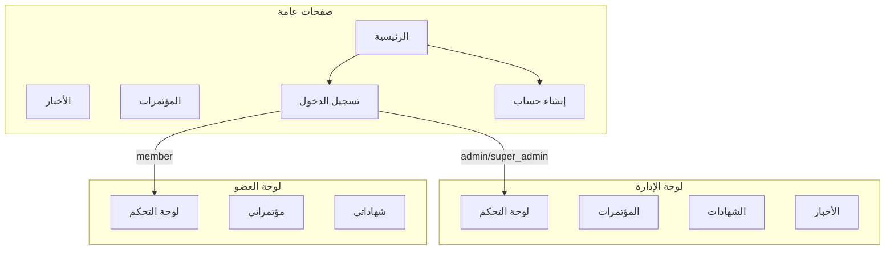

# الدليل التعريفي للفريق - موقع الجمعية اليمنية للجراحة الوعائية

دليل إرشادي يشرح صفحات الفرونت إند، أنواع الحسابات، والحسابات الوهمية المتوفرة للاختبار. يُستخدم كمرجع تعريفي لأعضاء الفريق لفهم هيكل الموقع.

---

## 1. مقدمة عن المشروع

- **YSVS** = الجمعية اليمنية للجراحة الوعائية (Yemeni Society for Vascular Surgery)
- النظام يتكون من:
  - **موقع عام**: صفحات للزوار (الأخبار، المؤتمرات، عن الجمعية، تواصل معنا)
  - **لوحة تحكم إدارة**: للإداريين لإدارة المحتوى والفعاليات والأعضاء
  - **لوحة تحكم أعضاء**: للمنتمين لعرض وتسجيل الفعاليات وشهاداتهم

---

## 2. أنواع الحسابات (User Roles)

| الدور           | المفتاح       | الصلاحيات                                                          |
| --------------- | ------------- | ------------------------------------------------------------------ |
| **Super Admin** | `super_admin` | صلاحيات كاملة، دخول لوحة الإدارة                                   |
| **Admin**       | `admin`       | إدارة المحتوى والفعاليات والأعضاء، دخول لوحة الإدارة وحساب العضو   |
| **Member**      | `member`      | دخول حساب العضو فقط (لوحة التحكم، مؤتمراتي، شهاداتي، الملف الشخصي) |
| **Public**      | `public`      | زائر غير مسجل - الوصول للصفحات العامة فقط                          |

### منطق التوجيه

- **`/dashboard`** يُوجّه حسب الدور:
  - Admin / Super Admin → `/admin`
  - Member → `/member`
  - غير مسجل → `/login`
- **لوحة الإدارة** (`/admin/*`) → `super_admin` و `admin` فقط
- **لوحة العضو** (`/member/*`) → `member` و `admin` و `super_admin`

---

## 3. خريطة الصفحات (Routes)

### أ) الصفحات العامة (Public) - لا تتطلب تسجيل دخول

| المسار                        | الصفحة                  | الوصف                          |
| ----------------------------- | ----------------------- | ------------------------------ |
| `/`                           | الرئيسية                | الصفحة الرئيسية للموقع         |
| `/about`                      | عن الجمعية              | معلومات عن الجمعية             |
| `/news`                       | الأخبار                 | قائمة المقالات والأخبار        |
| `/news/:slug`                 | تفاصيل الخبر            | عرض مقال واحد                  |
| `/events`                     | المؤتمرات               | قائمة الفعاليات                |
| `/events/:slug`               | تفاصيل المؤتمر          | عرض فعالية واحدة والتسجيل فيها |
| `/contact`                    | تواصل معنا              | نموذج التواصل                  |
| `/verify` و `/verify/:serial` | التحقق من الشهادة       | التحقق من صحة شهادة CME        |
| `/login`                      | تسجيل الدخول            | نموذج الدخول                   |
| `/register`                   | إنشاء حساب              | التسجيل كعضو جديد              |
| `/forgot-password`            | نسيت كلمة المرور        | طلب إعادة تعيين                |
| `/reset-password/:token`      | إعادة تعيين كلمة المرور | إكمال إعادة التعيين            |

### ب) لوحة الإدارة (Admin) - تتطلب دور admin أو super_admin

| المسار                          | الصفحة          | الوصف                                     |
| ------------------------------- | --------------- | ----------------------------------------- |
| `/admin`                        | لوحة التحكم     | إحصائيات (فعاليات، أعضاء، شهادات، مقالات) |
| `/admin/events`                 | قائمة المؤتمرات | إدارة الفعاليات                           |
| `/admin/events/create`          | إضافة مؤتمر     | إنشاء فعالية جديدة                        |
| `/admin/events/:id/edit`        | تعديل مؤتمر     | تعديل فعالية                              |
| `/admin/events/:id/registrants` | المسجلون        | قائمة وتفاصيل المسجلين في الفعالية        |
| `/admin/certificates`           | سجل الشهادات    | قائمة الشهادات الصادرة                    |
| `/admin/certificates/issue`     | إصدار شهادات    | إصدار شهادات للمسجلين                     |
| `/admin/streaming`              | البث المباشر    | إعدادات البث الحي                         |
| `/admin/articles`               | قائمة الأخبار   | إدارة المقالات                            |
| `/admin/articles/create`        | إضافة خبر       | إنشاء مقال                                |
| `/admin/articles/:id/edit`      | تعديل خبر       | تعديل مقال                                |
| `/admin/members`                | الأعضاء         | إدارة أعضاء الجمعية                       |
| `/admin/board`                  | مجلس الإدارة    | إدارة أعضاء مجلس الإدارة                  |
| `/admin/media`                  | مكتبة الوسائط   | رفع وإدارة الملفات                        |
| `/admin/settings`               | الإعدادات       | إعدادات عامة للنظام                       |

### ج) لوحة العضو (Member) - تتطلب عضو مسجل

| المسار                 | الصفحة       | الوصف                                 |
| ---------------------- | ------------ | ------------------------------------- |
| `/member`              | لوحة التحكم  | ملخص تسجيلاتي، شهاداتي، مرحباً بالعضو |
| `/member/profile`      | الملف الشخصي | تعديل البيانات الشخصية                |
| `/member/events`       | مؤتمراتي     | تسجيلاتي في الفعاليات                 |
| `/member/certificates` | شهاداتي      | الشهادات الصادرة للعضو                |

---

## 4. الحسابات الوهمية (Seeds) للاختبار

**كلمة المرور الافتراضية لجميع الحسابات:** `Password123!`

| البريد الإلكتروني     | الاسم (عربي)  | الدور       | ملاحظات                            |
| --------------------- | ------------- | ----------- | ---------------------------------- |
| `superadmin@ysvs.com` | المشرف الأعلى | Super Admin | صلاحيات كاملة                      |
| `admin@ysvs.com`      | أحمد المدير   | Admin       | مدير نموذجي للتطوير                |
| `member1@ysvs.com`    | د. فاطمة علي  | Member      | عضو موثق، له تسجيلات وشهادات       |
| `member2@ysvs.com`    | د. محمد حسن   | Member      | عضو موثق                           |
| `member3@ysvs.com`    | د. سارة أحمد  | Member      | عضو موثق                           |
| `member4@ysvs.com`    | د. خالد عمر   | Member      | عضو غير موثق (`isVerified: false`) |

### تشغيل Seeds

```bash
cd ysvs-backend
npm run seed        # إضافة بيانات دون حذف الموجودة
npm run seed:fresh  # حذف كل البيانات وإعادة البذر
```

**ملاحظة:** يجب أن يكون MongoDB يعمل ومتصل (مثلاً عبر `MONGODB_URI` في `.env`).

---

## 5. مخطط تدفق الصفحات



---

## 6. هيكل الملفات الرئيسية

| الملف                                                                                                                     | الوصف                               |
| ------------------------------------------------------------------------------------------------------------------------- | ----------------------------------- |
| [ysvs-frontend/src/router.tsx](../ysvs-frontend/src/router.tsx)                                                           | تعريف جميع المسارات والروابط        |
| [ysvs-frontend/src/components/shared/ProtectedRoute.tsx](../ysvs-frontend/src/components/shared/ProtectedRoute.tsx)       | حماية المسارات حسب الأدوار          |
| [ysvs-frontend/src/components/shared/DashboardRedirect.tsx](../ysvs-frontend/src/components/shared/DashboardRedirect.tsx) | توجيه `/dashboard` حسب دور المستخدم |
| [ysvs-backend/src/database/seed/seed.service.ts](../ysvs-backend/src/database/seed/seed.service.ts)                       | خدمة إنشاء البيانات الوهمية         |
| [ysvs-backend/src/database/seed/README.md](../ysvs-backend/src/database/seed/README.md)                                   | وثائق Seeds في الباك إند            |
