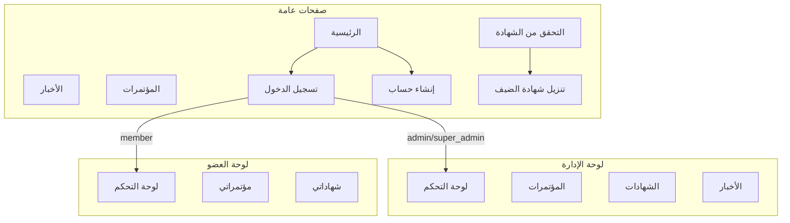

# الدليل التعريفي للفريق - موقع الجمعية اليمنية للجراحة الوعائية

دليل إرشادي يشرح صفحات الفرونت إند، أنواع الحسابات، الحسابات الوهمية للاختبار، وحالة التنفيذ الحالية. يُستخدم كمرجع داخلي للفريق لفهم هيكل المنصة وما هو مكتمل أو يحتاج متابعة.

---

## 1. مقدمة عن المشروع

- **YSVS** = الجمعية اليمنية للجراحة الوعائية (Yemeni Society for Vascular Surgery)
- النظام يتكون من:
  - **موقع عام**: صفحات للزوار (الأخبار، المؤتمرات، عن الجمعية، تواصل معنا، التحقق من الشهادات)
  - **لوحة تحكم إدارة**: للإداريين لإدارة المحتوى والفعاليات والأعضاء والشهادات
  - **لوحة تحكم أعضاء**: للمنتمين لعرض التسجيلات والشهادات والملف الشخصي

---

## 2. أنواع الحسابات (User Roles)

| الدور           | المفتاح       | الصلاحيات الأساسية                                                   |
| --------------- | ------------- | -------------------------------------------------------------------- |
| **Super Admin** | `super_admin` | صلاحيات كاملة، بما فيها حذف المستخدمين                               |
| **Admin**       | `admin`       | إدارة المحتوى والفعاليات والشهادات، ودخول لوحة الإدارة + لوحة العضو |
| **Member**      | `member`      | دخول لوحة العضو فقط (مؤتمراتي، شهاداتي، الملف الشخصي)              |
| **Public**      | `public`      | زائر غير مسجل - وصول للصفحات العامة فقط                             |

### منطق التوجيه

- **`/dashboard`** يُوجّه حسب الدور:
  - Admin / Super Admin -> `/admin`
  - Member -> `/member`
  - غير مسجل -> `/login`
- **لوحة الإدارة** (`/admin/*`) -> `super_admin` و `admin` فقط
- **لوحة العضو** (`/member/*`) -> `member` و `admin` و `super_admin`

---

## 3. خريطة الصفحات (Routes)

### أ) الصفحات العامة (Public) - لا تتطلب تسجيل دخول

| المسار                            | الصفحة                  | الوصف                                       |
| --------------------------------- | ----------------------- | ------------------------------------------- |
| `/`                               | الرئيسية                | الصفحة الرئيسية للموقع                      |
| `/about`                          | عن الجمعية              | معلومات عن الجمعية                          |
| `/news`                           | الأخبار                 | قائمة المقالات والأخبار                     |
| `/news/:slug`                     | تفاصيل الخبر            | عرض مقال واحد                               |
| `/events`                         | المؤتمرات               | قائمة الفعاليات                             |
| `/events/:slug`                   | تفاصيل المؤتمر          | عرض فعالية واحدة والتسجيل فيها              |
| `/contact`                        | تواصل معنا              | نموذج التواصل                               |
| `/verify` و `/verify/:serial`     | التحقق من الشهادة       | التحقق من صحة شهادة CME                     |
| `/certificate-download?token=...` | تنزيل شهادة ضيف         | تنزيل شهادة الضيف عبر رابط مؤقت موقّع       |
| `/login`                          | تسجيل الدخول            | نموذج الدخول                                |
| `/register`                       | إنشاء حساب              | التسجيل كعضو جديد                           |
| `/forgot-password`                | نسيت كلمة المرور        | طلب إعادة تعيين                             |
| `/reset-password/:token`          | إعادة تعيين كلمة المرور | إكمال إعادة التعيين                         |

### ب) لوحة الإدارة (Admin) - تتطلب دور `admin` أو `super_admin`

| المسار                          | الصفحة          | الوصف                                     |
| ------------------------------- | --------------- | ----------------------------------------- |
| `/admin`                        | لوحة التحكم     | إحصائيات (فعاليات، أعضاء، شهادات، مقالات) |
| `/admin/events`                 | قائمة المؤتمرات | إدارة الفعاليات                           |
| `/admin/events/create`          | إضافة مؤتمر     | إنشاء فعالية جديدة                        |
| `/admin/events/:id/edit`        | تعديل مؤتمر     | تعديل فعالية                              |
| `/admin/events/:id/registrants` | المسجلون        | قائمة وتفاصيل المسجلين في الفعالية        |
| `/admin/certificates`           | سجل الشهادات    | قائمة الشهادات الصادرة                    |
| `/admin/certificates/issue`     | إصدار شهادات    | إصدار شهادات للمسجلين                     |
| `/admin/streaming`              | البث المباشر    | إعدادات البث الحي                         |
| `/admin/articles`               | قائمة الأخبار   | إدارة المقالات                            |
| `/admin/articles/create`        | إضافة خبر       | إنشاء مقال                                |
| `/admin/articles/:id/edit`      | تعديل خبر       | تعديل مقال                                |
| `/admin/members`                | الأعضاء         | إدارة أعضاء الجمعية                       |
| `/admin/board`                  | مجلس الإدارة    | إدارة أعضاء مجلس الإدارة                  |
| `/admin/media`                  | مكتبة الوسائط   | رفع وإدارة الملفات                        |
| `/admin/settings`               | الإعدادات       | إعدادات الحساب والأمان                    |

### ج) لوحة العضو (Member) - تتطلب عضو مسجل

| المسار                 | الصفحة       | الوصف                                 |
| ---------------------- | ------------ | ------------------------------------- |
| `/member`              | لوحة التحكم  | ملخص تسجيلاتي، شهاداتي، مرحباً بالعضو |
| `/member/profile`      | الملف الشخصي | تعديل البيانات الشخصية                |
| `/member/events`       | مؤتمراتي     | تسجيلاتي في الفعاليات                 |
| `/member/certificates` | شهاداتي      | الشهادات الصادرة للعضو                |

---

## 4. تدفقات مهمة للفريق (Guest + Certificates)

### 4.1 تسجيل الضيف في مؤتمر

- المسؤول عن إتاحة تسجيل الضيف هو إعداد المؤتمر:
  - `registrationAccess = authenticated_only` -> التسجيل يتطلب تسجيل دخول.
  - `registrationAccess = public` -> يسمح بتسجيل الضيوف بدون حساب.
- بريد الضيف يتحكم فيه `guestEmailMode`:
  - `required` -> البريد مطلوب دائماً.
  - `optional` -> البريد اختياري.
- **قاعدة عمل مهمة:** إذا المؤتمر يمنح `cmeHours > 0` يصبح بريد الضيف مطلوباً حتى لو `guestEmailMode = optional`.

### 4.2 ربط سجل الضيف تلقائياً بالحساب

- عند **تسجيل حساب جديد** أو **تسجيل الدخول**، النظام يحاول ربط التسجيلات والشهادات السابقة المسجلة كبريد ضيف بنفس بريد الحساب.
- النتيجة ترجع في `guestLinkResult` (عدد التسجيلات/الشهادات المرتبطة + التعارضات المتخطاة).

### 4.3 تنزيل شهادة الضيف

- روابط شهادة الضيف تُبنى كالتالي: `/certificate-download?token=...`
- الـ token موقع وصالح لمدة **72 ساعة**.

---

## 5. الحسابات الوهمية (Seeds) للاختبار

**كلمة المرور الافتراضية لجميع الحسابات:** `Password123!`

| البريد الإلكتروني     | الاسم (عربي)  | الدور       | ملاحظات                            |
| --------------------- | ------------- | ----------- | ---------------------------------- |
| `superadmin@ysvs.com` | المشرف الأعلى | Super Admin | صلاحيات كاملة                      |
| `admin@ysvs.com`      | أحمد المدير   | Admin       | مدير نموذجي للتطوير                |
| `member1@ysvs.com`    | د. فاطمة علي  | Member      | عضو موثق، له تسجيلات وشهادات       |
| `member2@ysvs.com`    | د. محمد حسن   | Member      | عضو موثق                           |
| `member3@ysvs.com`    | د. سارة أحمد  | Member      | عضو موثق                           |
| `member4@ysvs.com`    | د. خالد عمر   | Member      | عضو غير موثق (`isVerified: false`) |

### تشغيل Seeds

```bash
cd ysvs-backend
npm run seed        # إضافة بيانات دون حذف الموجودة
npm run seed:fresh  # حذف كل البيانات وإعادة البذر
```

**ملاحظة:** يجب أن يكون MongoDB يعمل ومتصل (مثلاً عبر `MONGODB_URI` في `.env`).

---

## 6. إعدادات البيئة والروابط المهمة

### Backend

- **API Prefix:** `api/v1`
- **Swagger:** `/api/docs`
- أهم متغيرات البيئة للفريق:
  - `MONGODB_URI`
  - `JWT_SECRET` و `JWT_REFRESH_SECRET`
  - `FRONTEND_URL`
  - `CORS_ORIGINS` (متعدد، مفصول بفواصل)
  - `STORAGE_PROVIDER` (`local` أو `r2`)
  - `R2_*` عند استخدام Cloudflare R2

### Frontend

- أهم متغير: `VITE_API_URL` (مثال: `https://<api-domain>/api/v1`).

---

## 7. حالة التنفيذ الحالية (Feature Status Matrix)

| الجزء | الحالة | ملاحظات |
| ----- | ------ | ------- |
| المسارات العامة والأساسية | ✅ مكتمل | الصفحة العامة، الأخبار، المؤتمرات، التحقق من الشهادات |
| تسجيل المؤتمرات الديناميكي + رفع الملفات | ✅ مكتمل | مع تحقق نوع/حجم الملف + دعم ضيوف |
| ربط تاريخ الضيف بالحساب | ✅ مكتمل | يتم تلقائياً بعد login/register |
| لوحة الإدارة - الأحداث/المقالات/الشهادات/البث/الوسائط | ✅ مكتمل جزئياً | وظائف أساسية تعمل |
| صفحة إدارة الأعضاء `/admin/members` | ⚠️ جزئي | حالياً تستخدم بيانات Mock في الواجهة |
| التواصل `/contact` | ⚠️ جزئي | إرسال النموذج محاكاة فقط (لا يوجد endpoint فعلي) |
| استعادة كلمة المرور بالبريد | ⚠️ جزئي | منطق الإرسال الفعلي للبريد غير مفعل بعد |

---

## 8. فروقات واجهة/خلفية يجب متابعتها

هذه البنود مهمة لتفادي أخطاء تكامل بين الـ frontend والـ backend:

- **Bulk certificates endpoint:**
  - الواجهة تستخدم: `/certificates/bulk-generate`
  - الخلفية توفر: `/certificates/generate-bulk/:eventId`
- **Revoke certificate method:**
  - الواجهة تستخدم `POST`
  - الخلفية تتوقع `PATCH` على `/certificates/:id/revoke`
- **Delete media parameter:**
  - الواجهة ترسل `_id`
  - الخلفية تتعامل مع `path` في `DELETE /media/:path`

> يفضّل توحيد هذه العقود قبل أي إصدار إنتاجي نهائي.

---

## 9. مخطط تدفق الصفحات


```mermaid
flowchart TB
    subgraph public [صفحات عامة]
        Home[الرئيسية]
        News[الأخبار]
        Events[المؤتمرات]
        Verify[التحقق من الشهادة]
        Login[تسجيل الدخول]
        Register[إنشاء حساب]
        GuestDownload[تنزيل شهادة الضيف]
    end
    subgraph admin [لوحة الإدارة]
        AdminDash[لوحة التحكم]
        AdminEvents[المؤتمرات]
        AdminCerts[الشهادات]
        AdminArticles[الأخبار]
    end
    subgraph member [لوحة العضو]
        MemberDash[لوحة التحكم]
        MemberEvents[مؤتمراتي]
        MemberCerts[شهاداتي]
    end
    Login -->|admin/super_admin| AdminDash
    Login -->|member| MemberDash
    Home --> Login
    Home --> Register
    Verify --> GuestDownload
```

---

## 10. هيكل الملفات المرجعية الرئيسية

| الملف | الوصف |
| ---- | ---- |
| [ysvs-frontend/src/router.tsx](../ysvs-frontend/src/router.tsx) | تعريف جميع المسارات والروابط |
| [ysvs-frontend/src/components/shared/ProtectedRoute.tsx](../ysvs-frontend/src/components/shared/ProtectedRoute.tsx) | حماية المسارات حسب الأدوار |
| [ysvs-frontend/src/components/shared/DashboardRedirect.tsx](../ysvs-frontend/src/components/shared/DashboardRedirect.tsx) | توجيه `/dashboard` حسب دور المستخدم |
| [ysvs-frontend/src/components/dynamic-form/DynamicForm.tsx](../ysvs-frontend/src/components/dynamic-form/DynamicForm.tsx) | نموذج التسجيل الديناميكي ودعم رفع الملفات |
| [ysvs-backend/src/modules/events/registration.service.ts](../ysvs-backend/src/modules/events/registration.service.ts) | منطق تسجيل الفعاليات (عضو/ضيف) والتحقق |
| [ysvs-backend/src/modules/auth/auth.service.ts](../ysvs-backend/src/modules/auth/auth.service.ts) | منطق تسجيل الدخول وربط سجل الضيف بالحساب |
| [ysvs-backend/src/modules/certificates/certificates.service.ts](../ysvs-backend/src/modules/certificates/certificates.service.ts) | إصدار/تحقق الشهادات وروابط تنزيل الضيف |
| [ysvs-backend/src/database/seed/seed.service.ts](../ysvs-backend/src/database/seed/seed.service.ts) | خدمة إنشاء البيانات الوهمية |
| [ysvs-backend/src/database/seed/README.md](../ysvs-backend/src/database/seed/README.md) | وثائق Seeds في الباك إند |
| [docs/PRODUCTION_RUNBOOK.md](./PRODUCTION_RUNBOOK.md) | دليل النشر والتحقق في الإنتاج |
| [docs/PHASE3_RELEASE_CHECKLIST.md](./PHASE3_RELEASE_CHECKLIST.md) | قائمة التحقق قبل الإصدار |
